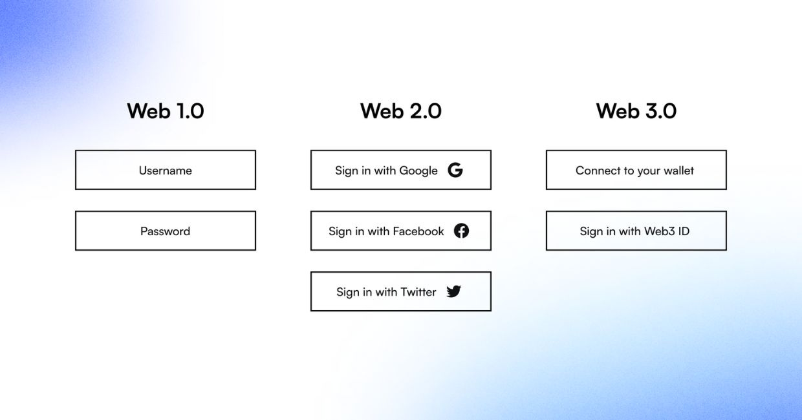

### **Организации**

-  Организация может принять решение не хранить данные пользователей во время процесса проверки, что может улучшить практику минимизации данных и снизить риск стать целью для крупномасштабных утечек данных со стороны хакеров.

-  Системы аутентификации Web3 могут помочь организациям соблюдать растущее число нормативных требований к данным.

-  Проверяет пользователей с помощью криптографии и блокчейна, что намного безопаснее, чем использование электронной почты, паролей и входов через социальные сети.

-  Создает более эффективный процесс регистрации, поскольку пользователи могут мгновенно получить доступ к сайту или приложению, а не проходить утомительную процедуру регистрации или входить в систему с помощью менее защищенной учетной записи социальной сети.

### **Физические лица**

-  Улучшенный пользовательский опыт за счет возможности мгновенного входа на несколько платформ с помощью цифровой идентификации без пароля и без необходимости управления дополнительными учетными записями.

-  Предотвратите взлом аккаунта с помощью криптографии

-  Пользователи контролируют свои данные и идентификаторы кошельков

-  Конфиденциальность защищена с помощью технологий доказательства с нулевым разглашением (доказательство чего-либо без раскрытия данных, которые подтверждают доказательство) и выборочного раскрытия (раскрытие только определенной части учетных данных). 

### **Разработчики**

-  Создавайте ориентированные на пользователя приложения, устраняющие необходимость в паролях

-  Возможность проверки данных в сети и за ее пределами

-  Устраняет неэффективные процессы аутентификации

### **Что такое вход в систему Web3?**

{width=1240px height=650px}