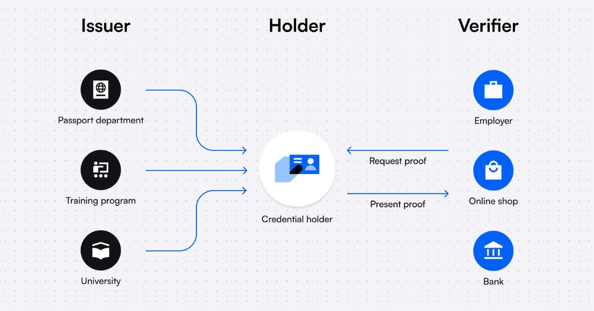

Децентрализованная идентификация -- это способ управления онлайн-идентификацией, который не зависит от хранения персональных данных в централизованных базах данных, таких как платформы социальных сетей или государственные системы идентификации. Децентрализованные системы идентификации позволяют пользователям полностью владеть и контролировать свои данные.

## **Три стороны децентрализованных систем идентификации**

1. **Эмитент:** Организация, имеющая полномочия выдавать проверяемые учетные данные, например, компания KYC, выдающая учетные данные KYC, или платформа онлайн-курсов, выдающая сертификаты об окончании обучения.

2. **Держатель:** Пользователь, владеющий учетными данными и хранящий их в своем цифровом кошельке.

3. **Проверяющий:** сторона, проверяющая или удостоверяющая подлинность учетных данных, например, работодатель, которому необходимо проверить образовательные документы кандидата, или персонал в магазине, которому необходимо подтвердить, что клиенту исполнилось 18 лет.

{width=1240px height=650px}

## **Технические составляющие децентрализованной идентичности**

### **Блокчейн**

Блокчейн действует как неизменяемый реестр, содержащий децентрализованные идентификаторы (DID) всех эмитентов учетных данных. При проверке учетных данных верификатор будет искать DID эмитента, чтобы убедиться, что это действительно тот эмитент, который подписал эти учетные данные.

**Что идет по цепочке?**

-  Децентрализованные идентификаторы эмитентов (DID) и связанные с ними открытые ключи

-  Реестры аннулирования

**Что не идет на цепь?**

-  Персональная информация

-  Проверяемые учетные данные. Учетные данные хранятся на устройствах пользователей (например, в их кошельках)

### **Децентрализованные идентификаторы (DID)**

Децентрализованные идентификаторы (DID) -- это уникальные идентификаторы, которые связаны с цифровой личностью. DID состоят из строки букв и цифр, которые могут храниться в блокчейне и использоваться для аутентификации этой личности.

Вот пример DID-идентификатора:

### `did:key:z6MkkUkFVaMDAcRUYgH3wYFYo6yjo6jyTziCEtewnu2me2vd`

Каждый созданный DID поставляется с парой закрытого и открытого ключей, а некоторые методы DID допускают использование нескольких пар ключей.

Всякий раз, когда организация выдает кому-либо проверяемые учетные данные, их публичный DID прикрепляется к этим учетным данным. Поскольку публичный DID (и публичный ключ эмитента) хранится в блокчейне, всякий раз, когда сторона хочет проверить подлинность учетных данных, она может проверить DID в блокчейне, чтобы убедиться, что это действительно закрытый ключ эмитента, который подписал учетные данные.

### **Проверяемые учетные данные**

Цифровые учетные данные, соответствующие модели данных проверяемых учетных данных, разработанной консорциумом World Wide Web (W3C), можно назвать проверяемыми учетными данными. Этот стандарт представляет собой «спецификацию, которая предоставляет стандартный способ выражения учетных данных в Интернете таким образом, который является криптографически безопасным, уважающим конфиденциальность и поддающимся машинной проверке».

**Преимущества проверяемых учетных данных:**

-  Мгновенная проверка, без необходимости связываться с эмитентом

-  Защита от несанкционированного доступа с использованием криптографии

-  Сохранение конфиденциальности путем предоставления держателям полного контроля над своими данными

